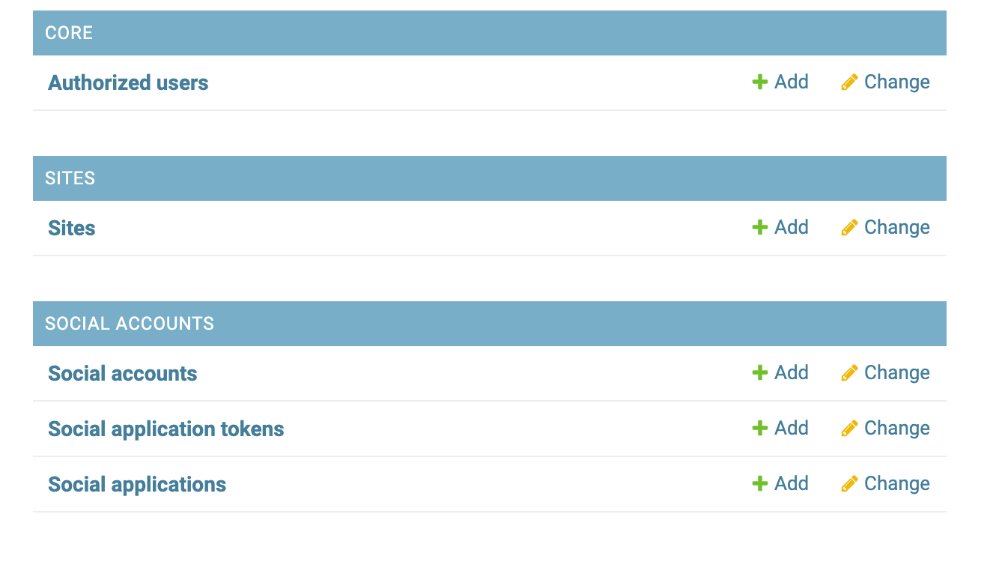
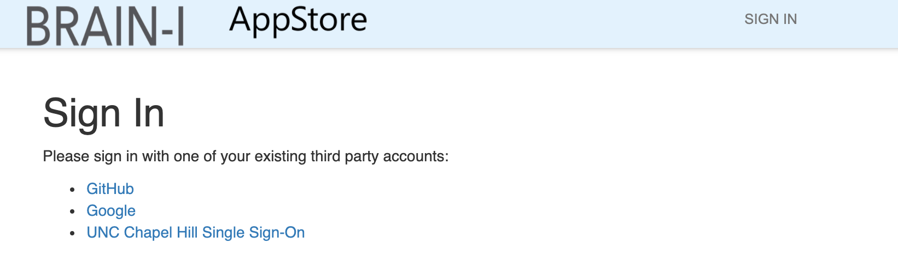
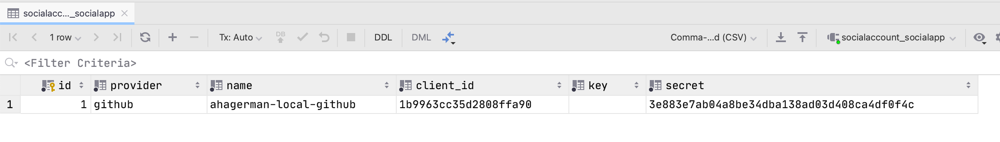
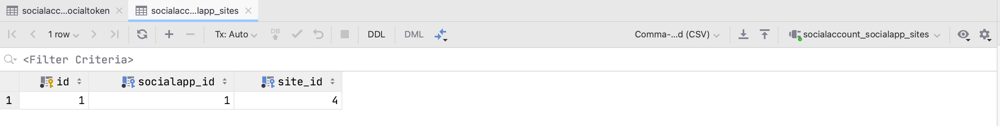
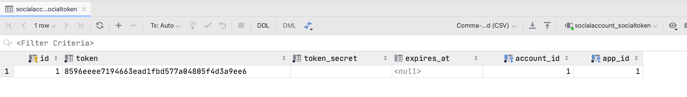

# AppStore Auth Flow

The HeLx Appstore supports the following login types:

| Type     | ENVIRONMENT_VARIABLE |
| -------- | -------------------- |
| Django   | ALLOW_DJANGO_LOGIN   |
| OAuth    | OAUTH_PROVIDERS      |
| SAML SSO | ALLOW_SAML_LOGIN     |

OAuth and SAML login require additional configuration as detailed below.

## OAuth Social Login

HeLx Appstore is currently deployed and tested with social auth
using the [django-allauth](https://django-allauth.readthedocs.io/en/latest/installation.html) package.
To configure oauth you need to setup your provider oauth application detailed
[here](https://django-allauth.readthedocs.io/en/latest/installation.html).

> Tip you can use a local address (for instance `0.0.0.0:8000`) when
> configuring the oauth homepage and callback urls for local dev/test
> or setup a hostname in /etc/hosts.

### Social Application Setup

To pre configure the social providers in django set the following environment variables:

- OAUTH_PROVIDERS
- \<PROVIDER>_CLIENT_ID
- \<PROVIDER>_SECRET
- \<PROVIDER>_NAME

And run:

```bash
DEV_PHASE=stub python manage.py addingwhitelistedsocialapp --settings=$settings  &&\
```

This executes the command found in `core/management/commands/addingwhitelistedsocialapp.py`
Populating the `social_app` and `social_app_sites` tables. Inspect these in the local `DATABASE.sqlite3` for more information.

Sites can also be configured via the admin panel -> "Social Accounts"



> More information is available in the [devops](https://github.com/helxplatform/devops#configure-environment-variables-for-helx-deployment)
configuration and [appstore](https://github.com/helxplatform/appstore/blob/develop/appstore/README.md#app-development)
docs.

### Auth Flow

When logging in with a social provider the following steps occur:

1. Navigate to the appstore

1. Clicke to the provider login url (ex: GitHub, Google)
1. Login with provider, if this is the first time grant the oauth app permissions
1. Provider redirects to the authorization callback url
1. Django verifies that the app is registered for this site (`SITE_ID`), see `socialaccount_socialapp` and `socialaccount_socialapp_sites`


1. The user is setup in `auth_user` if they do not exist
1. The `AllowWhiteListedUserOnly` middleware checks if the user should be allowed to
view a page after being logged in
1. Assuming a user logged in and whitelisted `User` Django sets up a session, and allauth
stores a token for the user in `socialaccount_socialtoken`

1. Inside of `core/views.py` there is a [Django signal receiver](https://docs.djangoproject.com/en/3.1/topics/signals/#connecting-receiver-functions)
that connects to an [allauth signal](https://django-allauth.readthedocs.io/en/latest/signals.html?highlight=pre_social_login#allauth-socialaccount)
and adds the user token as `Authorization` to the session
1. The user is now authenticated and able to navigate to the apps page or other endpoints

> The middleware checks the relationship between the whitelist group in `auth_group` and the user `auth_user` via `auth_users_groups`. See `AUTHORIZED_USERS` for setting this up locally or in deployment. This can also be managed via the admin panel.

> This demo application has since been deleted

## SAML SSO Login

Along with social auth we also support SSO via SAML. Currently the `braini` and
`restartr` settings contain the provider information to sign in with UNC SSO.

For information on SAML Okta has a good [article](https://developer.okta.com/docs/concepts/saml/)
along with a [comparison](https://www.okta.com/identity-101/saml-vs-oauth/)to OAuth2. Keep
in mind that regardless of the identity provider for a user (GitHub, Google, UNC),
the appstore still has a whitelist group that the user must be part of to actually
use `/apps`.

For SAML based auth we currently use the [django-saml2-auth](https://github.com/fangli/django-saml2-auth)
package and setup a given saml providers details in the app specific `/settings`
file.

When running `braini` or `restartr` UNC is displayed as a login option. For this
login to work a UNC administrator must configure the SAML identity provider with
the deployment environments details, and have the metadata provided
(preferably at a discoverable URL) for use by the appstore. This is one
of the larger changes compared with the social auth providers since you cannot
created, update and delete the provider application as needed for development
and testing purposes. Today `braini-dev` is setup with UNC SAML SSO in blackbalsam
and is an environment to test changes in.

Assuming the SAML SSO provider has configured settings on their end, and settings
are available in `appstore/settings/<application>_settings.py`:

1. Navigate to the appstore
1. Click the SSO provider (ex: UNC)
1. Login with provider
1. Provider redirects to the callback url
1. The user is setup in `auth_user` if they do not exist
1. The `AllowWhiteListedUserOnly` middleware checks if the user should be allowed
to view a page after being authenticated
1. Assuming an authenticated and whitelisted `User` Django sets up a session
1. The user is now authenticated and able to navigate to the apps page or other endpoints
